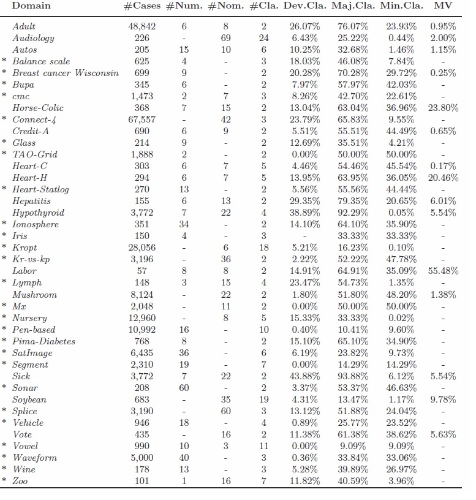

# 1. Sample Document

## 1.1. Section

Our code in python is

```python
from sklearn.datasets import load_iris
iris = load_iris()
```

### 1.1.1. Subsection

This is a subsection under Section 1.

## 1.2. Section

This is another section in the document.

### 1.2.1. Subsection

This is a subsection under Section 2.

## 1.3. Example Table

| Header 1 | Header 2 |
| ---------|----------|
| Cell 1   | Cell 2   |
| Cell 3   | Cell 4   |

Table: Example Table Caption

Referencing the table in text: The table in **Section 2.1** is shown in Table 1.

## 1.4. Example Image


Image: Example Image Caption

Using html syntax:


<figcaption>Figure N. List of available datasets</figcaption>
</img>

Referencing the image in text: The image in [Section about python code](#11-section) is displayed in Figure N.

## 1.5. References

1. [Link to a Reference](https://example.com)
2. Another reference.
