0.1. Table of Contents
------------------------------------------------------

- [1. Introduction](#1-introduction)
- [2. Chosen Datasets](#2-chosen-datasets)
- [3. Implementation of PCA algorithm](#3-implementation-of-pca-algorithm)
  - [3.1. Implementation Decisions](#31-implementation-decisions)
    - [3.1.1. Covariance Matrix Calculation](#311-covariance-matrix-calculation)
    - [3.1.2. Eigenvalues and Eigenvectors Calculation](#312-eigenvalues-and-eigenvectors-calculation)
    - [3.1.3. Sorting Eigenvalues and Eigenvectors](#313-sorting-eigenvalues-and-eigenvectors)
    - [3.1.4. Storing Components](#314-storing-components)
    - [3.1.5. Centering Data](#315-centering-data)
    - [3.1.6. Transformation](#316-transformation)
    - [3.1.7. Sign Convention](#317-sign-convention)
- [4. Analysis and Exploration](#4-analysis-and-exploration)
  - [4.1. PCA Developed in this work](#41-pca-developed-in-this-work)
  - [4.2. Sklearn PCA](#42-sklearn-pca)
  - [4.3. Sklearn IncrementalPCA](#43-sklearn-incrementalpca)
- [5. Use PCA with k-Means and BIRCH to compare performances](#5-use-pca-with-k-means-and-birch-to-compare-performances)
- [6. Cluster the transformed Data (SVD) using K-Means and Birch](#6-cluster-the-transformed-data-svd-using-k-means-and-birch)
- [7. Visualize in low-dimensional space](#7-visualize-in-low-dimensional-space)
- [8. Conclusions](#8-conclusions)
- [9. Bibliography](#9-bibliography)


# 1. Introduction
This report runs through different dimensionality reduction algorithms. It explores the differences between these and the outputs they produce. The paper explores a custom PCA and compares this with the Sklearn PCA, the Incremental PCA, and the Truncated SVD. Finally, we visualize these results in a low-dimensional space with PCA and ISOMAP.

We will run the experiments using two base algorithms: K-Means and BIRCH. 
* K-means clustering is a partitioning algorithm that divides a dataset into K distinct, non-overlapping subsets (clusters) where each data point belongs to the cluster with the nearest mean.
* BIRCH (Balanced Iterative Reducing and Clustering using Hierarchies) is a hierarchical clustering algorithm that incrementally builds a tree-like structure to represent the data distribution efficiently.

These results will run over the datasets explained in the following section.

# 2. Chosen Datasets

The vote dataset is composed of 435 samples and 17 features. All the features are categorical and binary. As all of its variables are categorical, this analysis is performed using One Hot Encoding. This is done to avoid the problem of ordinality.

The glass dataset contains 214 instances, each with 9 features and 1 target variable: 'Type'. The dataset is made up of float values, except for the glass type which is a categorical value.

The heart-h dataset is composed of 294 instances and 14 attributes, including the predicted one "num". The features are both categorical and numerical. This predicted attribute signifies the diagnosis of angiographic heart disease, classifying cases into two categories. A value of 0 indicates less than 50% diameter narrowing in the coronary arteries, suggesting a less severe condition. Conversely, a value of 1 denotes more than 50% diameter narrowing, indicating a more critical and potentially advanced stage of heart disease. 

# 3. Implementation of PCA algorithm

Principal Component Analysis (PCA) is a widely used technique for dimensionality reduction and feature extraction. This section discusses the decisions made in the implementation of a PCA class in Python.

## 3.1. Implementation Decisions

### 3.1.1. Covariance Matrix Calculation

The first crucial step in PCA is to compute the covariance matrix. In this implementation, the `np. cov` function is used with `rowvar=False` to ensure that columns represent variables and rows represent observations. This choice is in line with standard practice and ensures that the resulting covariance matrix has dimensions matching the number of features.

```python
cov = np.cov(X, rowvar=False)
```

### 3.1.2. Eigenvalues and Eigenvectors Calculation

To find the principal components, eigenvalues and eigenvectors of the covariance matrix are computed. The decision to use `np.linalg.eigh` is appropriate, as it assumes the input matrix is Hermitian (symmetric for real matrices) and utilizes a more stable algorithm for eigenvalue decomposition compared to `np.linalg.eig`.

```python
eigenvalues, eigenvectors = np.linalg.eigh(cov)
```

### 3.1.3. Sorting Eigenvalues and Eigenvectors

To maintain consistency and facilitate interpretation, eigenvalues and their corresponding eigenvectors are sorted in descending order. The use of `np.argsort` is efficient, and the resulting index array is reversed (`[::-1]`) to ensure the highest eigenvalue comes first.

```python
idx = np.argsort(eigenvalues)[::-1]
eigenvalues = eigenvalues[idx]
eigenvectors = eigenvectors[:, idx]
```

### 3.1.4. Storing Components

The first `n` eigenvectors are stored as principal components. This decision aligns with the goal of dimensionality reduction, retaining only the most important features.

```python
self.components_ = eigenvectors[:, :self.n_components_]
```

### 3.1.5. Centering Data

Centering the data by subtracting the mean is performed at two stages: during the fit and transform steps. This ensures consistency in the treatment of data, aligning with the fundamental principle of PCA.

```python
X -= np.mean(X, axis=0)
```

### 3.1.6. Transformation

The transformation of the data is accomplished by projecting it onto the selected principal components. The transformation function is implemented efficiently using matrix multiplication.

```python
transformed_X = np.dot(X, self.components_)
```

### 3.1.7. Sign Convention

The decision to return the negation of the transformed data (`return -transformed_X`) is a choice made to align with the sign convention of the `sklearn.decomposition.PCA` class. This choice is arbitrary, as the sign of the principal components is not unique.
<br></br>
```python
return -transformed_X
```

# 4. Analysis and Exploration

In this section, we will explore the Vote dataset with the PCA algorithm. 

## 4.1. PCA Developed in this work

In this section, we will explore the results obtained with the implementation of our PCA. Some examples are provided for one of the datasets because the results are similar for all of them.

Given that these transformations are linear and based on the covariance matrix, no real-world understanding can be extracted, at first glance, from the new coordinates. An example can be found in Table 1.


|   | PC1       | PC2       | PC3       | PC4       | PC5       |
|---|-----------|-----------|-----------|-----------|-----------|
| 0 | -2.538132 | 0.208806  | -0.664641 | -0.174588 | 0.450081  |
| 1 | -2.566310 | 0.385575  | 0.730238  | 0.070440  | 0.545899  |
| 2 | -1.181888 | 1.863804  | -0.193548 | -0.056694 | -0.517372 |

<!-- Center Table caption -->
<figcaption style="text-align:center;font-size:0.8em">Table 1: First 3 samples for vote dataset in the new PC space using our implementation of PCA</figcaption>


Given that the data is implicitly centered but not standardized, the mean of the data is zero but its variance is not one. It doesn't affect the results but it is important to take into account when analyzing the results. As can be observed in the following table, the mean of the data is zero but the variance is not one.

|      | PC1          | PC2          | PC3          | PC4          | PC5          |
|------|--------------|--------------|--------------|--------------|--------------|
| mean | 1.429253e-16 | -1.250596e-16| 6.061562e-17 | 2.261760e-16 | -2.779386e-16|
| std  | 1.899175e+00 | 8.106390e-01 | 7.187142e-01 | 6.343247e-01 | 5.914352e-01 |
| min  | -2.674723e+00| -1.830662e+00| -1.672052e+00| -1.657765e+00| -2.113420e+00|
| max  | 2.520503e+00 | 2.093992e+00 | 1.432702e+00 | 1.671510e+00 | 1.636564e+00 |
<figcaption style="text-align:center;font-size:0.8em">Table 2: Transformed vote dataset description </figcaption>

It's also interesting to analyze the loadings of the transformation. The loadings are the eigenvectors of the covariance matrix. They represent the direction of the maximum variance. In Table 3 an example is shown.

| Feature                           | PC1       | PC2       | PC3       | PC4       | PC5       |
|-----------------------------------|-----------|-----------|-----------|-----------|-----------|
| handicapped-infants_n             | 0.256762  | -0.093263 | 0.088130  | 0.325191  | -0.187823 |
| handicapped-infants_y             | -0.247978 | 0.092984  | -0.092867 | -0.325534 | 0.188177  |
| water-project-cost-sharing_n      | -0.060097 | -0.332781 | -0.013825 | 0.126901  | 0.282068  |
<figcaption style="text-align:center;font-size:0.8em">Table 3: Loadings for vote dataset </figcaption>

The results for the handmade PCA projection on the three datasets are shown in the following figures. The first two components are plotted to visualize the data in a 2D space. The first component is the one that separates the classes the most. The second component separates the classes but not as much as the first one.


<div class="image-container">
  
   <!-- Adjust as needed -->
</div>

<div>
  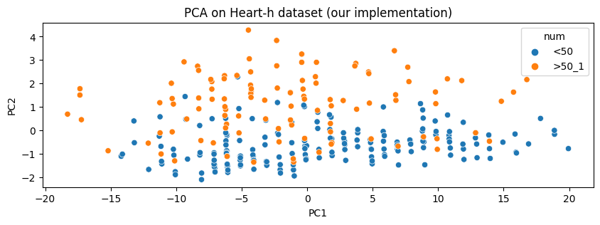
  <figcaption style="text-align:center;font-size:0.8em">Figure 1: Projection results handmade PCA for a vote (left), glass (right), and heart-h (bottom) dataset</figcaption>
</div>
<br/><br/>
<br/><br/>
<br/><br/>
<div class="image-container">
  
   <!-- Adjust as needed -->
</div>

<div>
  
  <figcaption style="text-align:center;font-size:0.8em">Figure 2: Relative Variance Explained handmade PCA for a vote (left), glass (right), and heart-h (bottom) datasets</figcaption>
</div>

It's noticeable that, in the vote dataset, half of the Principal Components don't explain anything. The reason is that the data is categorical and binary and in our One Hot Encoding, there is a column for Yes and another one for No. This causes each pair of features to be linearly dependent and hence, they don't provide any information, which is represented as a zero variance in the PC space. In Table 3 can be observed that the "No" class loadings are the opposite of the "Yes" class loadings.

In the case of glass data, we can see that the the variance is slowly reduced until it reaches 0, where the ninth principal component does not explain any of the variance in the graph. The seventh component corresponds to around 4% of the variance that is explained in the first component. 

And in the case of heart-h dataset, we can see that the first principal component is the one that explains the major part of the variance, with a proportion of 0.91 of the variance. This is similar to what happens in the vote dataset, although now the difference between the first and the second component is higher. These results could be attributed to several factors in the preprocessing pipeline when dealing with different types of variables, such as standardizing numerical features, imputing missing values with the median, and encoding categorical variables. 

In the following sections, we can, therefore, see the contrast between variance in a categorical dataset (such as vote), a continuous-variables dataset (glass), and a dataset containing both categorical and continuous-variables (heart-h).


## 4.2. Sklearn PCA

When Scikit-Learn's implementation is applied to our dataset, the results are the same concerning the coordinates in our new PC space. This happens independently of the datasets.

|   | PC1       | PC2       | PC3       | PC4       | PC5       |
|---|-----------|-----------|-----------|-----------|-----------|
| 0 | 2.538132  | 0.208806  | 0.664641  | -0.174588 | -0.450081 |
| 1 | 2.566310  | 0.385575  | -0.730238 | 0.070440  | -0.545899 |
| 2 | 1.181888  | 1.863804  | 0.193548  | -0.056694 | 0.517372  |
<br/><br/>
<br/><br/>
<figcaption style="text-align:center;font-size:0.8em">Table 4: First 3 samples for vote dataset in the new PC space using sklearn PCA</figcaption>

The only difference found is that the signs are not the same in some of the components. This is because the only restrictions are in the orthogonality and unitarity of the components. But there is freedom in the choice of the sign of the components.


The explained variance results are also the same in all the cases, given that the same one-shot algorithm is used.

## 4.3. Sklearn IncrementalPCA

The PCA object proves to be beneficial but exhibits limitations when dealing with large datasets. Its primary drawback is its exclusive support for batch processing, necessitating that all data fit into the main memory. In contrast, the IncrementalPCA object offers an alternative processing approach, enabling partial computations that closely align with PCA results while handling data in a minibatch manner.

|   | PC1       | PC2       | PC3       | PC4       | PC5       |
|---|-----------|-----------|-----------|-----------|-----------|
| 0 | 2.538132  | 0.208806  | 0.664641  | 0.174588  | -0.450081 |
| 1 | 2.566310  | 0.385575  | -0.730238 | -0.070440 | -0.545899 |
| 2 | 1.181888  | 1.863804  | 0.193548  | 0.056694  | 0.517372  |
<figcaption style="text-align:center;font-size:0.8em">Table 5: First 3 samples for vote dataset in the new PC space using IncrementalPCA</figcaption>

The main difference is performance in time and memory. The Incremental PCA is much faster for big datasets than the PCA and it uses less memory. However, the results are not the same. The explained variance ratio is the same but the components are not. This is because the IncrementalPCA is an approximation of the PCA. 

What can be observed from the following comparison is that, when batch size is increased, IPCA is faster and uses less memory. However, in this case, approximation error from IPCA is negligible. This is observed from the difference in the first explained variance ratio and the average difference in components. The approximation error is not noticeable.

On the other hand, it doesn't either speed up the process. This is because the dataset is not big enough to notice the difference. For the glass dataset, some erratic performance is observed for certain batch sizes. The reasons are, probably, numerical inestability and the heterogeneity of the batches (i.e. two batches can contain very different instances).
 
<div class="image-container">
  
   <!-- Adjust as needed -->
</div>

<div>
  
  
  <figcaption style="text-align:center;font-size:0.8em">Figure 3: Training time (left axis) for different batch sizes together with explained variance (blue) and average difference between components wrt PCA (green) for vote (left), glass (right) and heart-h (bottom) datasets</figcaption>
</div>


For a `batch_size` equal to the number of samples, the results are the same as the PCA. This is because the algorithm is the same. The visible difference in the plots can be due to external factors such as the random initialization of the algorithm.

As an illustrative example, a comparison in time performance has been done with the vote dataset. Our implementation of PCA is faster than the incremental one until `batch_size` of 260. However, when `batch_size` is increased, the IPCA is faster as is expected given that sklearn PCA is faster than ours.

    

<figcaption style="text-align:center;font-size:0.8em">Figure 4: Comparison in training time for vote dataset</figcaption>

From these figures, we can conclude that there isn't a significant change in the current variance explained by each component. However, we know that the IncrementalPCA is designed to be a more efficient form of PCA: losing some accuracy to change and having better memory and temporal usage. This is specifically useful for larger datasets, we can see that the training time in the incremental PCA starts to be noticeable very early, and around the 420 batch, we can see a large difference between our PCA, the incremental PCA, and the Sklearn PCA. Indicating, that the larger we make the batch size the greater the difference we will see between the computational times in the different versions of the PCA.


# 5. Use PCA with k-Means and BIRCH to compare performances

In this section, our implementation of PCA and k-Means, together with sklearn's BIRCH, are used to cluster the data.


<div class="image-container">
  
   <!-- Adjust as needed -->
</div>
  

<div>
  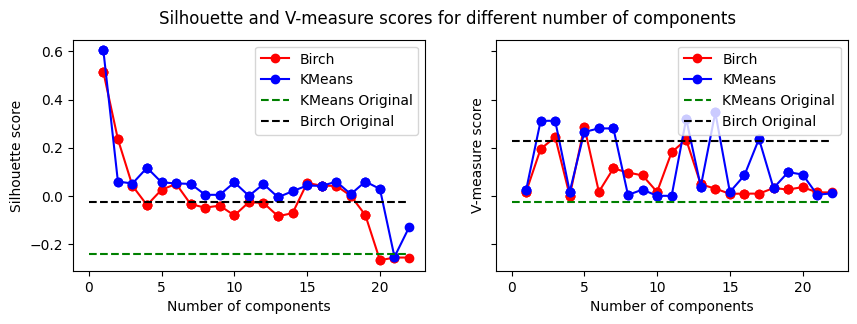
  <figcaption style="text-align:center;font-size:0.8em">Figure 5: Performance comparison for clustering using different numbers of components for a vote (left), glass (right), and heart-h (bottom) datasets</figcaption>
</div>

**Vote dataset**

As shown in Figure 1, for the vote dataset after projecting the data into the 2 first Principal Components, the classes are quite well separated. A lot of variables weren't providing almost any information in terms of variance. This causes the well-known dimensionality curse, in which when the number of features is increased, the performance of the algorithm decreases. This is why PCA is used, to reduce the number of features and hence, the dimensionality of the data.

As can be inferred from the previous plot, in every case, incrementing the number of components even adding more information, leads to equal or worse results. This is because of the dimensionality curse. The more features, the worse the performance of the algorithm. In the case of silhouette score, a model trained only with the first component has far better value than in the case of the model trained without applying PCA. On the other hand, in terms of V-Measure, KMeans increases its performance when trained with just one component. However, Birch's performance slightly decreases. As it is an informed external metric, it is more sensitive to information loss.

Another interesting fact is that both algorithms have the same performance when trained with the first component.

|                                     | BIRCH | KMeans | Birch (PC1) | KMeans (PC1) |
|-------------------------------------|---------------------------|---------------------------|-------------------|--------------------|
| Silhouette                          | 0.26                      | 0.35                      | 0.74              | 0.74               |
| V-Measure                           | 0.64                      | 0.54                      | 0.54              | 0.54               |
<figcaption style="text-align:center;font-size:0.8em">Table 6: Vote dataset. Performance using PCA and not using it.</figcaption>


**Glass dataset**

After projecting the glass dataset, it can be observed that only using the first 2 components is not enough to make the classes separable given the complexity of the problem.

In the case of silhouette score, a model trained only with the first component has a far better silhouette score than in the case of the model trained without applying PCA. On the other hand, in terms of V-Measure, both Birch and K-Means' performance slightly increases with 2 and 6 components, but decreases in other cases. KMeans obtains a maximum with 4 components whereas Birch obtains the maximum V-Measure score with 4 components.


|                                     | BIRCH | KMeans | Birch (PC1) | KMeans (PC1) |
|-------------------|----------------------------------|-----------------------------------|--------------------|----------------------|
| Silhouette        | 0.42                             | 0.23                              | 0.56               | 0.55                 |
| V-Measure         | 0.39                             | 0.16                              | 0.05               | 0.24                 |
<figcaption style="text-align:center;font-size:0.8em">Table 7: Glass dataset. Performance using PCA and not using it.</figcaption>


**Heart-h dataset**

In Heart-h dataset, we can observe that the silhouette results are better when training a model with the first component after applying PCA for both KMeans and Birch. Getting optimal results with 1 component for both algorithms means that the information loss is not significant, as PC1 can capture most of the variance. However, Birch's performance in terms of V-Measure gets worse with this technique in comparison to the model trained without applying PCA, while KMeans performance does not improve either. Birch maximises its V-Measure score with 5 components whereas KMeans maximises its V-Measure score with 14 components.


|                                     | BIRCH | KMeans | Birch (PC1) | KMeans (PC1) |
|-------------------------------------|---------------------------|---------------------------|-------------------|--------------------|
| Silhouette                          | -0.02                      | -0.24                      | 0.51              | 0.55               |
| V-Measure                           | 0.23                      | 0.01                      | 0.02              | 0.01               |
<figcaption style="text-align:center;font-size:0.8em">Table 6: Vote dataset. Performance using PCA and not using it.</figcaption>


<div class="image-container">
  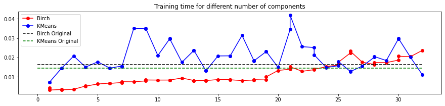 
   <!-- Adjust as needed -->
</div>    

<div>
  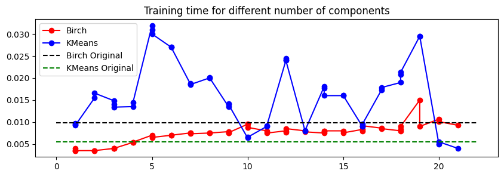
  <figcaption style="text-align:center;font-size:0.8em">Figure 6: Performance in time comparison for clustering using different numbers of components for a vote (left), glass (right), and heart-h (bottom) datasets</figcaption>
</div>

We can see in Figures 6 and 7 a slight improvement in the temporal capacity of the algorithms as well. Again we see that due to the size of the chosen datasets, the temporal difference is not as significant as it would be with a larger dataset. Either way, we see that Birch shows promising results both in the training scores and the efficiency of the datasets.

# 6. Cluster the transformed Data (SVD) using K-Means and Birch

The Singular Value Decomposition (SVD) is a fundamental numerical linear algebra technique that decomposes a matrix into three other matrices. Given a matrix $A$ of dimensions $m \times n$, the SVD can be represented as:

$$
A = U \Sigma V^T
$$

where:
- $U$ is an $m \times m$ orthogonal matrix (meaning $(U^T U = I)$, where $I$ is the identity matrix).
- $\Sigma$ is an $m \times n$ diagonal matrix with non-negative real numbers on the diagonal, known as the singular values. The singular values are arranged in descending order.
- $V$ is an $n \times n$ orthogonal matrix.

The SVD is widely used in various applications, such as dimensionality reduction, noise reduction, and solving linear equations. In the context of machine learning, SVD is often used in techniques like Principal Component Analysis (PCA) for dimensionality reduction and collaborative filtering in recommendation systems.


If SVD is directly applied to the data, the behavior is strange. The first singular value is the lowest one and the rest are sorted from higher to lower magnitude.

|   | SV1       | SV2       | SV3       | SV4       | SV5       |
|---|-----------|-----------|-----------|-----------|-----------|
| 0 | 2.706905  | -2.462044 | 0.216076  | 0.663765  | -0.177440 |
| 1 | 2.929801  | -2.476804 | 0.409878  | -0.735057 | 0.086129  |
| 2 | 2.464877  | -1.118496 | 1.868968  | 0.186572  | -0.044793 |
<figcaption style="text-align:center;font-size:0.8em">Table 8: Vote dataset. First 5 Singular Components.</figcaption>

<!-- 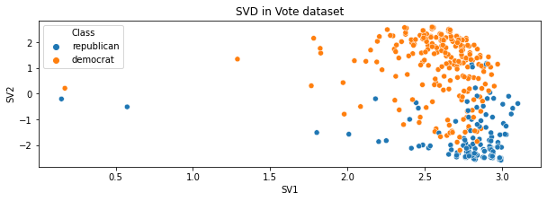

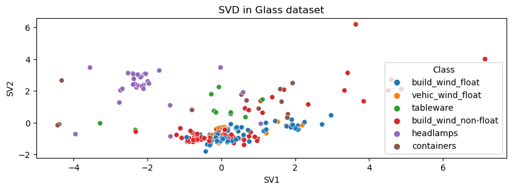 -->
    
<div class="image-container">
  
   <!-- Adjust as needed -->
</div> 

<div>
  
  <figcaption style="text-align:center;font-size:0.8em">Figure 7: Performance in time comparison for clustering using different numbers of components for vote (left), glass (right), and heart-h (bottom) datasets</figcaption>
</div>

The results in the case of the vote and heart-h datasets are quite different from the ones obtained from PCA. After running some other experiments, it's been noticed that this effect is due to the scale of the features. When Standard Scaler is applied, the results are virtually the same as in PCA (except sign). For the glass dataset, the results are the same as in sklearn's PCA (the same as in Figure 1 except change in signs).

The distribution of the explained variance ratio by singular values is similar to the one we had for PCA but in this case, the first singular value is the lowest one, being 0.01, the second one 0.47, the third one 0.08, and the rest are decreasing in magnitude. 

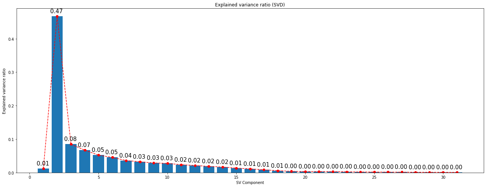
  <figcaption style="text-align:center;font-size:0.8em">Figure: Performance in clustering using a different number of components for vote and glass datasets and SVM</figcaption> 

This can be due to this scaling issue. In the case of glass data sets, the distribution is similar to the one obtained in PCA for explained variance ratio.

<div class="image-container">
  
   <!-- Adjust as needed -->
</div>


<div>
  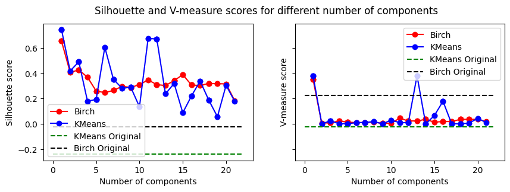
  <figcaption style="text-align:center;font-size:0.8em">Figure 8: Performance in clustering using different number of components for a vote (left), glass (right) and heart-h (bottom) datasets and SVM</figcaption>
</div>

# 7. Visualize in low-dimensional space

In this subsection, original data sets are visualized together with the result of the k-Means and BIRCH algorithms without the dimensionality reduction, and the result of the k-Means and BIRCH algorithms with the dimensionality reduction. To visualize in a lowdimensional space (2D or 3D) PCA and ISOMAP approaches are used. 

Isomap clustering is a dimensionality reduction and clustering algorithm that can be used to visualize and cluster high-dimensional data. It works by constructing a graph of the data points, where the edges of the graph represent the distances between the data points. The algorithm then finds a lower-dimensional embedding of the data points, while preserving the distances between the data points as much as possible.

**Vote dataset**

Given that the data is categorical, the visualization of its 2 first components is not very useful. Until now, 2 first linear projections have been used to visualize the data, such as SVD and PCA. The result is that they both provide similar information.

In this case, Self Organized Maps are used to have a nonlinear point of view, i.e. to use a different approach.


    
<div class="image-container">
  
  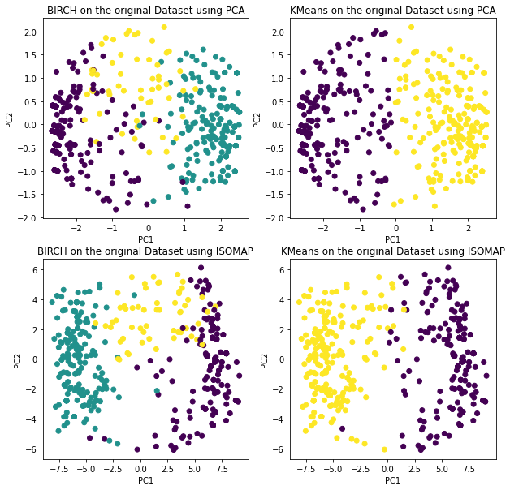 <!-- Adjust as needed -->
</div>
 <figcaption style="text-align:center;font-size:0.8em">Figure 9: Vote dataset. Visualization of projection using SOM (Isomap) and PCA</figcaption>   


In this case, both algorithms provide similar information. This can be because the data is not very complex and hence, the linear projection is enough to visualize the data. It's interesting to notice that the internal structure analyzed by the SOM algorithm is almost identical to the one found by PCA.

**Glass dataset**


<div class="image-container">
  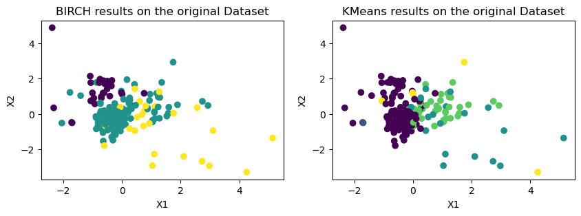
   <!-- Adjust as needed -->

</div>
<figcaption style="text-align:center;font-size:0.8em">Figure 10: Glass dataset. Visualization of projection using SOM (Isomap) and PCA</figcaption> 

The scatter plot in the image shows the lower-dimensional embedding of the Glass dataset using isomap. In this case, the structure of the clusters completely changes. The SOM algorithm can find a more complex structure than the one found by PCA. This is because the SOM algorithm can find nonlinear relationships between the features. This makes the categories much more separable.

**Heart-h dataset**


<div class="image-container">
  
  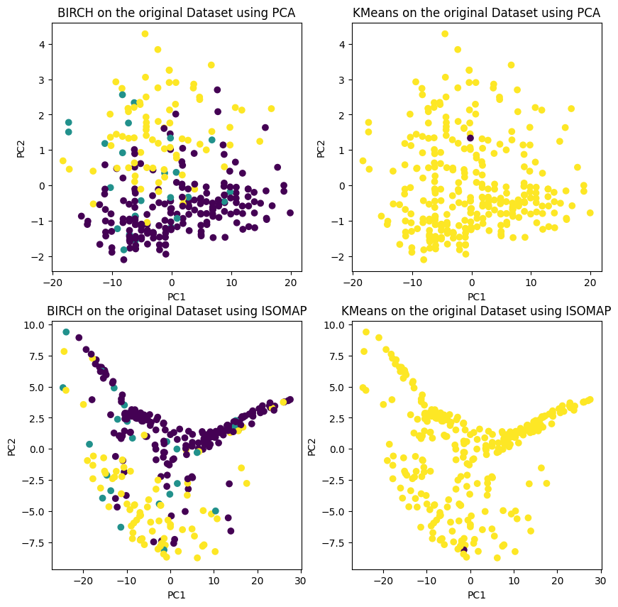 <!-- Adjust as needed -->

</div>
<figcaption style="text-align:center;font-size:0.8em">Figure 11: Heart-h dataset. Visualization of projection using SOM (Isomap) and PCA</figcaption> 

Finally, for heart-h a more complex structure is found as in the case of glass. However, in this case, it's not as easy for the algorithms to find separable structures in data.

# 8. Conclusions

**Q1. Is PCA giving you more advice for knowing the underlying information in the data set?**

PCA (Principal Component Analysis) is a dimensionality reduction technique that transforms the original features into a new set of orthogonal features, called principal components. These components capture the maximum variance in the data. The analysis provided indicates that PCA has been successful in capturing the underlying information in the datasets. The projection of data into the principal component space allows for visualization, clustering, and exploration of the dataset's structure. The loadings of the principal components provide insights into the contribution of each original feature to the new components, aiding in understanding the dataset's variability.

In this case, for **vote dataset**, provides useful information about the correlation between "yes" and "no" features, marking as non-informative the results of one of them as. In addition to that, the original dataset has 16 features, and PCA allows us to reduce it to 1 single feature preserving half of the information (47% of total variance). This mitigates the effect of the curse of dimensionality and allows to use of simpler models.

For the **glass dataset**, PCA isn't that effective, as the variance is not completely captured by the first component. In this case, PCA allows to reduce the dimensionality of the dataset to 2 features, preserving 43% of the information. This is not a big reduction, but it allows us to visualize the data in a 2D space, and to use simpler models. However, it can be observed that, given the complexity of the problem, this dimensionality reduction is not enough to make the problem easily separable.

Finally, in the case of **hearth dataset**, most of the variance can be explained by the first variable. However, when projected into a 2D space, it can be observed that the data is almost linearly separable. This means that PCA simplifies a lot of the problem, reducing computational time and avoiding noise coming from redundant features.

**Q2. Is BIRCH giving you more advice for knowing the underlying information in the data set?**

The analysis suggests that BIRCH is effective in clustering the data but may not provide as much insight into the underlying information as PCA. While BIRCH is powerful for clustering large datasets and providing a hierarchical structure, it might not offer the same interpretability as PCA in terms of understanding the contribution of each feature to the dataset's structure.

**Q3. Can you explain the setup that you have used for the PCA algorithm?**

The setup for PCA involves applying the PCA algorithm to three datasets: Vote, Glass, and Heart-h. The implementation includes computing the covariance matrix, obtaining the eigenvectors (loadings), projecting the data into the new principal component space, and analyzing the results. The PCA algorithm has been implemented both manually and using the scikit-learn library. The manual implementation involves:

- centering the data (not standardizing)
- computing the covariance matrix, obtaining the eigenvectors 
- projecting the data onto the principal components
- saving eigenvalues as explained variance
- calculate the relative explained variance for each of the components

**Q4. Can you reduce the dimensionality of the data set? In case of an affirmative answer, detail how you do and how many features have been reduced from the original data set.**

The answer to this question can be found in Question 1.

**Q5. Can you detail how you decided to make the reduction using truncatedSVD you obtained and how much has been reduced from the original data set**

The results after applying SVD were almost identical to the ones obtained by PCA. This is because PCA is a special case of SVD, where the data is centered and scaled. For **glass** and **heart-h** datasets, data is unintentionally centered.

The most particular case was found for **vote dataset**. For this one, singular values weren't sorted in descending order, a first singular value was much lower than the rest appeared. This was observed to be due to the scale and the presence of outliers. However, this problem was solved when data was scaled, obtaining the same results as PCA.

**Q6. Do you obtain the same results from your code of PCA as the code in sklearn? Explain the similarities and differences among the two implementations.**

They worked mostly in the same way in terms of the results obtained. The explained variance of all the components is equal in both cases and the absolute value of the components.

An observed detail is that in some of the PCA features, the signs are the opposite of the ones provided by sklearn. This is because, mathematically, there is freedom in the choice of the signs. This is a consequence of eigenvectors being defined as directions that can be generated by two opposite vectors, both with norm one. This is not a problem, given that orthogonality and unit norm are preserved.

In execution time, the manual implementation resulted slightly slower than the one provided by sklearn. This is because the implementation provided by sklearn is optimized, and it uses a different algorithm to compute the covariance matrix.

**Q7. Can you explain if you obtain similar clusters with the data set reduced to those obtained in the original data? In addition, have you observed a reduction in time?**

Yes, the clustering task performs differently with and without dimensionality reduction for all of the datasets. The clustering obtained after preserving just the first component outperforms the direct application of KMeans and BIRCH on the original dataset. It does it in terms of execution time and terms of chosen metrics (silhouette score and V-measure).

**Q8. What are the similarities and differences in the visualizations obtained using PCA and ISOMAP?**

Isomap clustering is a dimensionality reduction and clustering algorithm that can be used to visualize and cluster high-dimensional data. It works by constructing a graph of the data points, where the edges of the graph represent the distances between the data points. The algorithm then finds a lower-dimensional embedding of the data points, while preserving the distances between the data points as much as possible.

In this case, both algorithms provide similar information. This can be because the data is not very complex and hence, the linear projection is enough to visualize the data. It's interesting to notice that the internal structure analyzed by the SOM algorithm is almost identical to the one found by PCA.

It's clear that, for the glass dataset,  the SOM algorithm can find a more complex structure than the one found by PCA. This is because the SOM algorithm can find nonlinear relationships between the features. This makes the categories much more separable.

Finally, for heart-h a more complex structure is found as in the case of glass. However, in this case, it's not as easy for the algorithms to find separable structures in data.


# 9. Bibliography
[1] Scikit-learn.org. 2020. Sklearn.Decomposition.PCA — Scikit-Learn 0.23.2
Documentation. [online] Available at:
<https://scikit-learn.org/stable/modules/generated/sklearn.decomposition.PCA.htm
l> [Accessed 14 November 2020].

[2] Scikit-learn.org. 2020. Sklearn.Decomposition.PCA — Scikit-Learn 0.23.2
Documentation. [online] Available at:
<https://scikit-learn.org/stable/modules/generated/sklearn.decomposition.PCA.htm
l> [Accessed 14 November 2020].

[3] Scikit-learn.org. 2020. Sklearn.Manifold.TSNE — Scikit-Learn 0.23.2 Documentation.
[online] Available at:
<https://scikit-learn.org/stable/modules/generated/sklearn.manifold.TSNE.html>
[Accessed 14 November 2020].

[4] wikipedia.org. 2020. Principal Component Analysis. [online] Available at:
<https://es.wikipedia.org/wiki/An%C3%A1lisis_de_componentes_principales>
[Accessed 14 November 2020].

[5] sitiobigdata.com. 2020. Tsne Con Python, Una Introducción - Sitiobigdata.Com.
[online] Available at:
<https://sitiobigdata.com/2019/10/27/una-introduccion-a-tsne-con-python/#>
[Accessed 14 November 2020].

[6] Ufldl.stanford.edu. 2020. Unsupervised Feature Learning And Deep Learning Tutorial.
[online] Available at:
<http://ufldl.stanford.edu/tutorial/unsupervised/PCAWhitening/> [Accessed 14
November 2020].