# Visualization on Heart-H Dataset

# 1. Load Data

Heart-h dataset is composed by 294 instances and 14 attributes, including the predicted one "num". The features are both categorical and numerical. This predicted attribute signifies the diagnosis of angiographic heart disease, classifying cases into two categories. A value of 0 indicates less than 50% diameter narrowing in the coronary arteries, suggesting a less severe condition. Conversely, a value of 1 denotes more than 50% diameter narrowing, indicating a more critical and potentially advanced stage of heart disease. 

We are displaying the first 3 samples of the dataset and 6 features in the following table:

<table border="1" class="dataframe">
  <thead>
    <tr style="text-align: right;">
      <th></th>
      <th>trestbps</th>
      <th>chol</th>
      <th>thalach</th>
      <th>oldpeak</th>
      <th>num</th>
      <th>age</th>
    </tr>
  </thead>
  <tbody>
    <tr>
      <th>0</th>
      <td>-0.146571</td>
      <td>-1.822595</td>
      <td>1.951019</td>
      <td>-0.646074</td>
      <td>0</td>
      <td>28</td>
    </tr>
    <tr>
      <th>1</th>
      <td>-0.715815</td>
      <td>-0.111523</td>
      <td>0.887616</td>
      <td>-0.646074</td>
      <td>0</td>
      <td>29</td>
    </tr>
    <tr>
      <th>2</th>
      <td>0.422673</td>
      <td>-0.111523</td>
      <td>1.312977</td>
      <td>-0.646074</td>
      <td>0</td>
      <td>29</td>
    </tr>
  </tbody>
</table>

# 2. Analyze your PCA algorithm in three data sets

We'll be analysing the Hearth-H dataset in this section, following the same data preprocessing steps as in the previous section, altough now he have both categorical and numerical features.

## 2.1. Handmade PCA

<table border="1" class="dataframe">
  <thead>
    <tr style="text-align: right;">
      <th></th>
      <th>PC1</th>
      <th>PC2</th>
      <th>PC3</th>
      <th>PC4</th>
      <th>PC5</th>
    </tr>
  </thead>
  <tbody>
    <tr>
      <th>0</th>
      <td>19.942972</td>
      <td>-0.775490</td>
      <td>-1.432465</td>
      <td>-0.661341</td>
      <td>-0.503625</td>
    </tr>
    <tr>
      <th>1</th>
      <td>18.884515</td>
      <td>-0.165038</td>
      <td>0.172079</td>
      <td>0.062065</td>
      <td>0.300040</td>
    </tr>
    <tr>
      <th>2</th>
      <td>18.873458</td>
      <td>0.001048</td>
      <td>0.089637</td>
      <td>-1.100515</td>
      <td>0.017054</td>
    </tr>
  </tbody>
</table>

<table border="1" class="dataframe">
  <thead>
    <tr style="text-align: right;">
      <th></th>
      <th>PC1</th>
      <th>PC2</th>
      <th>PC3</th>
      <th>PC4</th>
      <th>PC5</th>
      <th>PC6</th>
      <th>PC7</th>
      <th>PC8</th>
      <th>PC9</th>
      <th>PC10</th>
      <th>PC11</th>
      <th>PC12</th>
      <th>PC13</th>
      <th>PC14</th>
      <th>PC15</th>
      <th>PC16</th>
      <th>PC17</th>
      <th>PC18</th>
      <th>PC19</th>
      <th>PC20</th>
      <th>PC21</th>
      <th>PC22</th>
    </tr>
  </thead>
  <tbody>
    <tr>
      <th>count</th>
      <td>2.940000e+02</td>
      <td>2.940000e+02</td>
      <td>2.940000e+02</td>
      <td>2.940000e+02</td>
      <td>2.940000e+02</td>
      <td>2.940000e+02</td>
      <td>2.940000e+02</td>
      <td>2.940000e+02</td>
      <td>2.940000e+02</td>
      <td>2.940000e+02</td>
      <td>2.940000e+02</td>
      <td>2.940000e+02</td>
      <td>2.940000e+02</td>
      <td>2.940000e+02</td>
      <td>2.940000e+02</td>
      <td>2.940000e+02</td>
      <td>2.940000e+02</td>
      <td>2.940000e+02</td>
      <td>2.940000e+02</td>
      <td>2.940000e+02</td>
      <td>2.940000e+02</td>
      <td>2.940000e+02</td>
    </tr>
    <tr>
      <th>mean</th>
      <td>-7.661294e-15</td>
      <td>1.146098e-16</td>
      <td>-1.269770e-16</td>
      <td>2.900174e-16</td>
      <td>-1.036114e-15</td>
      <td>6.561267e-16</td>
      <td>-5.162159e-16</td>
      <td>5.611535e-16</td>
      <td>1.215959e-16</td>
      <td>-1.338687e-16</td>
      <td>9.856062e-16</td>
      <td>6.085457e-16</td>
      <td>-3.607281e-16</td>
      <td>2.784998e-17</td>
      <td>-2.501778e-18</td>
      <td>1.311309e-16</td>
      <td>-2.675958e-16</td>
      <td>3.087100e-17</td>
      <td>-9.913886e-17</td>
      <td>9.817193e-18</td>
      <td>6.262721e-16</td>
      <td>-3.121912e-17</td>
    </tr>
    <tr>
      <th>std</th>
      <td>7.835270e+00</td>
      <td>1.307990e+00</td>
      <td>9.757137e-01</td>
      <td>9.368646e-01</td>
      <td>8.115657e-01</td>
      <td>5.646234e-01</td>
      <td>5.249738e-01</td>
      <td>4.519087e-01</td>
      <td>4.242909e-01</td>
      <td>3.656728e-01</td>
      <td>3.391418e-01</td>
      <td>2.694416e-01</td>
      <td>2.502781e-01</td>
      <td>1.804793e-01</td>
      <td>1.734407e-01</td>
      <td>1.648201e-01</td>
      <td>1.516985e-01</td>
      <td>1.423246e-01</td>
      <td>1.066374e-01</td>
      <td>5.415396e-02</td>
      <td>3.876227e-02</td>
      <td>3.130474e-02</td>
    </tr>
    <tr>
      <th>min</th>
      <td>-1.829171e+01</td>
      <td>-2.097980e+00</td>
      <td>-2.456299e+00</td>
      <td>-3.175192e+00</td>
      <td>-2.354213e+00</td>
      <td>-1.775204e+00</td>
      <td>-1.418635e+00</td>
      <td>-1.533876e+00</td>
      <td>-1.047806e+00</td>
      <td>-1.499048e+00</td>
      <td>-1.044377e+00</td>
      <td>-1.057312e+00</td>
      <td>-1.006650e+00</td>
      <td>-1.002597e+00</td>
      <td>-8.926934e-01</td>
      <td>-6.456526e-01</td>
      <td>-6.375557e-01</td>
      <td>-8.850583e-01</td>
      <td>-6.237944e-01</td>
      <td>-8.542288e-01</td>
      <td>-7.396274e-02</td>
      <td>-6.650314e-02</td>
    </tr>
    <tr>
      <th>25%</th>
      <td>-6.139552e+00</td>
      <td>-1.010586e+00</td>
      <td>-6.058154e-01</td>
      <td>-5.629263e-01</td>
      <td>-6.096239e-01</td>
      <td>-2.712387e-01</td>
      <td>-3.490986e-01</td>
      <td>-2.772719e-01</td>
      <td>-3.024544e-01</td>
      <td>-7.447401e-02</td>
      <td>-1.844245e-01</td>
      <td>-8.922470e-02</td>
      <td>-7.996872e-02</td>
      <td>-2.669474e-02</td>
      <td>-1.257901e-02</td>
      <td>-5.422533e-02</td>
      <td>-6.112592e-02</td>
      <td>-2.754309e-02</td>
      <td>-7.597382e-03</td>
      <td>-7.613522e-03</td>
      <td>-5.275826e-03</td>
      <td>-3.382478e-03</td>
    </tr>
    <tr>
      <th>50%</th>
      <td>-1.006625e+00</td>
      <td>-3.746159e-01</td>
      <td>-5.635322e-02</td>
      <td>1.622571e-01</td>
      <td>-5.424970e-02</td>
      <td>1.360190e-01</td>
      <td>-2.869240e-02</td>
      <td>8.960227e-02</td>
      <td>-7.651067e-02</td>
      <td>1.011767e-01</td>
      <td>-1.532231e-02</td>
      <td>4.940233e-02</td>
      <td>1.983746e-02</td>
      <td>2.680975e-02</td>
      <td>2.133854e-02</td>
      <td>1.666181e-02</td>
      <td>2.969899e-02</td>
      <td>2.037007e-02</td>
      <td>1.062232e-02</td>
      <td>-1.207019e-04</td>
      <td>2.963785e-04</td>
      <td>4.591988e-04</td>
    </tr>
    <tr>
      <th>75%</th>
      <td>5.856893e+00</td>
      <td>9.020613e-01</td>
      <td>4.603938e-01</td>
      <td>6.591103e-01</td>
      <td>5.559384e-01</td>
      <td>4.349367e-01</td>
      <td>4.742823e-01</td>
      <td>2.860049e-01</td>
      <td>2.856202e-01</td>
      <td>1.931087e-01</td>
      <td>1.934152e-01</td>
      <td>1.354615e-01</td>
      <td>1.131656e-01</td>
      <td>6.989663e-02</td>
      <td>6.980840e-02</td>
      <td>5.246038e-02</td>
      <td>7.265450e-02</td>
      <td>6.698301e-02</td>
      <td>3.286519e-02</td>
      <td>9.415596e-03</td>
      <td>5.177822e-03</td>
      <td>4.418037e-03</td>
    </tr>
    <tr>
      <th>max</th>
      <td>1.994297e+01</td>
      <td>4.280725e+00</td>
      <td>5.008286e+00</td>
      <td>2.783377e+00</td>
      <td>2.278664e+00</td>
      <td>9.692482e-01</td>
      <td>1.147417e+00</td>
      <td>1.220085e+00</td>
      <td>1.200886e+00</td>
      <td>7.430148e-01</td>
      <td>8.638978e-01</td>
      <td>8.314452e-01</td>
      <td>8.577367e-01</td>
      <td>4.225386e-01</td>
      <td>3.284366e-01</td>
      <td>6.435748e-01</td>
      <td>5.464477e-01</td>
      <td>3.034643e-01</td>
      <td>2.105314e-01</td>
      <td>9.499028e-02</td>
      <td>6.207672e-01</td>
      <td>4.962028e-01</td>
    </tr>
  </tbody>
</table>

The tables above represent the principal components of the data set. Key insights regarding the PCA algorithm can be observed:

- The mean values of the principal components are all close to zero, signifying that the data is centered around the origin.
- The standard deviation of PC1 is 7.83, indicating variability along this component, and the consequent components have lower standard deviations, which suggests less variability along these directions.
- The first principal component also demonstrates a large range of values, highlighting the broad data amplitude along this component, when compared to the other components.

    

    

    
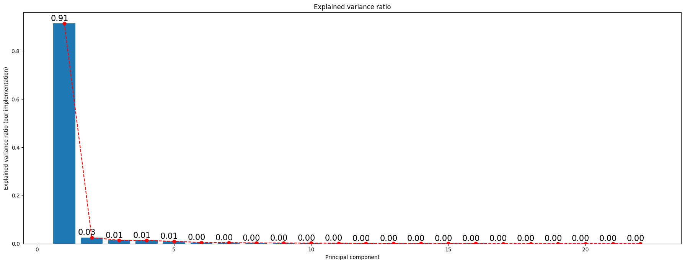
    

In the graphic representations above, we can observe that PC1 and PC2 are clearly able to separate the data into two different classes. The first component is able to capture the most important information of the data set, with a proportion of variance of 0.91.

The high variance explained by PC1 in the results could be attributed to several factors in the preprocessing pipeline, such as standardizing numerical features, imputing missing values with the median, and encoding categorical variables. 

## 2.2. Sklearn PCA

<table border="1" class="dataframe">
  <thead>
    <tr style="text-align: right;">
      <th></th>
      <th>PC1</th>
      <th>PC2</th>
      <th>PC3</th>
      <th>PC4</th>
      <th>PC5</th>
    </tr>
  </thead>
  <tbody>
    <tr>
      <th>0</th>
      <td>19.942972</td>
      <td>-0.775490</td>
      <td>-1.432465</td>
      <td>0.661341</td>
      <td>0.503625</td>
    </tr>
    <tr>
      <th>1</th>
      <td>18.884515</td>
      <td>-0.165038</td>
      <td>0.172079</td>
      <td>-0.062065</td>
      <td>-0.300040</td>
    </tr>
    <tr>
      <th>2</th>
      <td>18.873458</td>
      <td>0.001048</td>
      <td>0.089637</td>
      <td>1.100515</td>
      <td>-0.017054</td>
    </tr>
  </tbody>
</table>

    
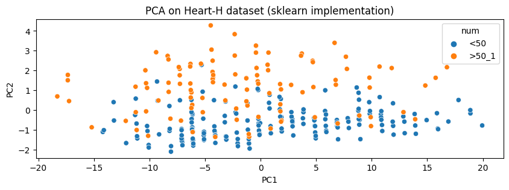
    

    
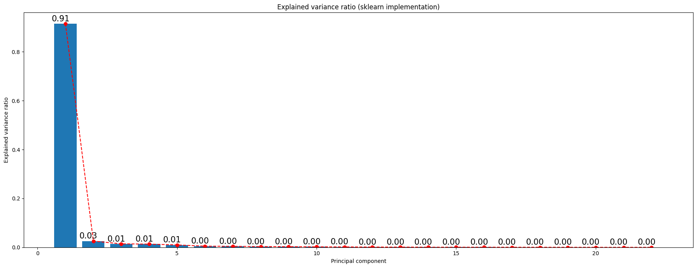
    

# 3. Compare with IncrementalPCA

<table border="1" class="dataframe">
  <thead>
    <tr style="text-align: right;">
      <th></th>
      <th>PC1</th>
      <th>PC2</th>
      <th>PC3</th>
      <th>PC4</th>
      <th>PC5</th>
    </tr>
  </thead>
  <tbody>
    <tr>
      <th>0</th>
      <td>-19.942972</td>
      <td>-0.775490</td>
      <td>-1.432465</td>
      <td>0.661341</td>
      <td>0.503625</td>
    </tr>
    <tr>
      <th>1</th>
      <td>-18.884515</td>
      <td>-0.165038</td>
      <td>0.172079</td>
      <td>-0.062065</td>
      <td>-0.300040</td>
    </tr>
    <tr>
      <th>2</th>
      <td>-18.873458</td>
      <td>0.001048</td>
      <td>0.089637</td>
      <td>1.100515</td>
      <td>-0.017054</td>
    </tr>
  </tbody>
</table>

    
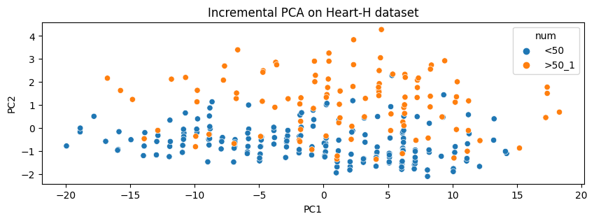
    

    
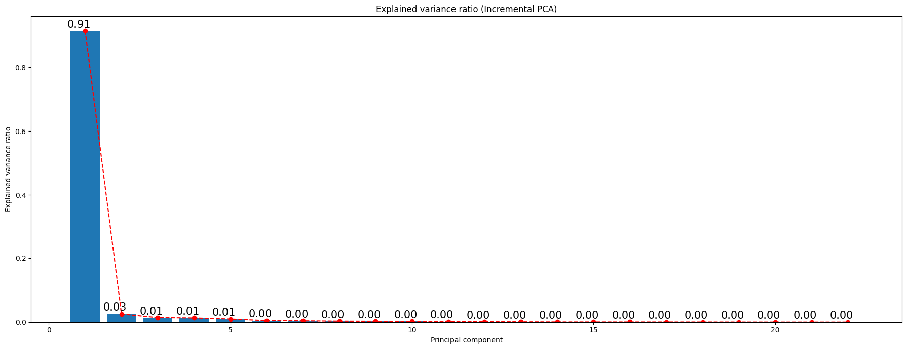
    

    
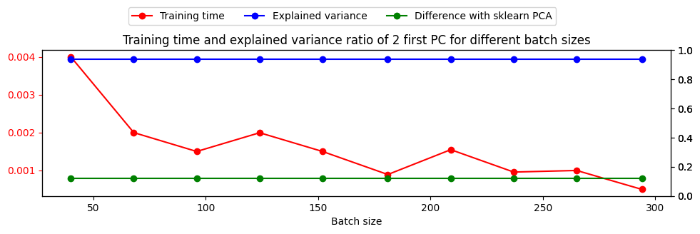
    

    
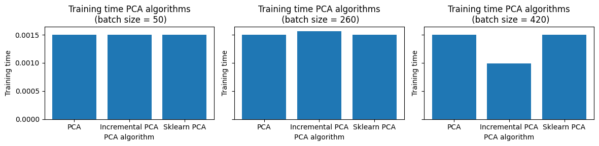
    

# 4. Use PCA with k-Means and BIRCH to compare performances

# Cluster the transformed Data using BIRCH

    [ 1  1  1  2  2  3  3  4  4  4  5  5  6  6  7  7  7  8  8  9  9 10 10 10
     11 11 12 12 13 13 13 14 14 15 15 16 16 16 17 17 18 18 19 19 19 20 20 21
     21 22]
    1
    1
    1
    2
    2
    3
    3
    4
    4
    4
    5
    5
    6
    6
    7
    7
    7
    8
    8
    9
    9
    10
    10
    10
    11
    An error occurred during silhouette score calculation: Number of labels is 1. Valid values are 2 to n_samples - 1 (inclusive)
    11
    An error occurred during silhouette score calculation: Number of labels is 1. Valid values are 2 to n_samples - 1 (inclusive)
    12
    12
    13
    13
    13
    14
    14
    15
    15
    16
    16
    16
    17
    17
    18
    18
    19
    19
    19
    20
    20
    21
    21
    22
    

    

    

    Evaluation results on BIRCH using the original dataset
    Silhouette -0.02 - V-Measure 0.23
    --------------------------------------------------
    Evaluation results on KMeans using the original dataset
    Silhouette -0.24 - V-Measure 0.01
    --------------------------------------------------
    Evaluation results on Birch using the PC1
    Silhouette 0.51 - V-Measure 0.02
    --------------------------------------------------
    Evaluation results on KMeans using the PC1
    Silhouette 0.60 - V-Measure 0.02
    

    <matplotlib.legend.Legend at 0x1f380573308>

    
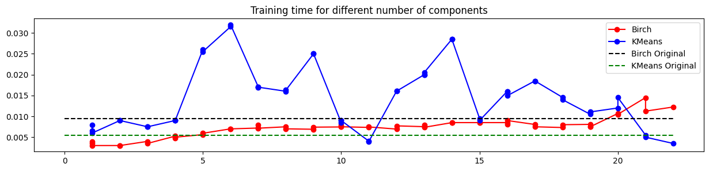
    

# 5. Cluster the transformed Data (SVD) using K-Means and Birch

## Non Centered Data

<table border="1" class="dataframe">
  <thead>
    <tr style="text-align: right;">
      <th></th>
      <th>SV1</th>
      <th>SV2</th>
      <th>SV3</th>
      <th>SV4</th>
      <th>SV5</th>
    </tr>
  </thead>
  <tbody>
    <tr>
      <th>0</th>
      <td>28.033093</td>
      <td>-2.256916</td>
      <td>-1.386641</td>
      <td>0.276079</td>
      <td>1.215486</td>
    </tr>
    <tr>
      <th>1</th>
      <td>29.049893</td>
      <td>-1.571977</td>
      <td>0.226575</td>
      <td>-0.307312</td>
      <td>0.409026</td>
    </tr>
    <tr>
      <th>2</th>
      <td>29.050171</td>
      <td>-1.397763</td>
      <td>0.123121</td>
      <td>0.773328</td>
      <td>0.916765</td>
    </tr>
  </tbody>
</table>

    
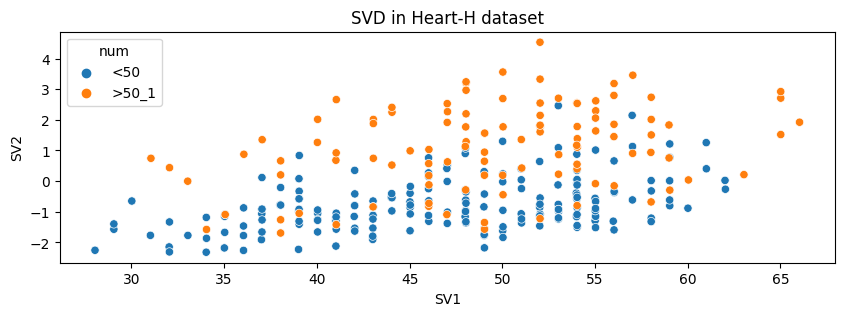
    

    
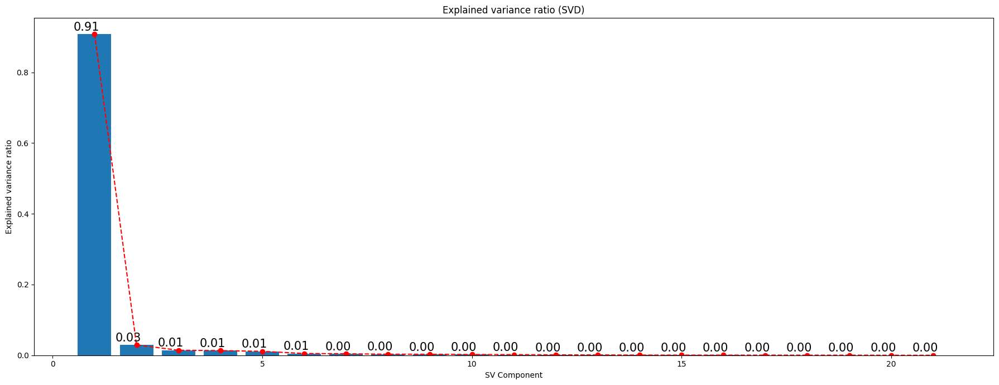
    

    
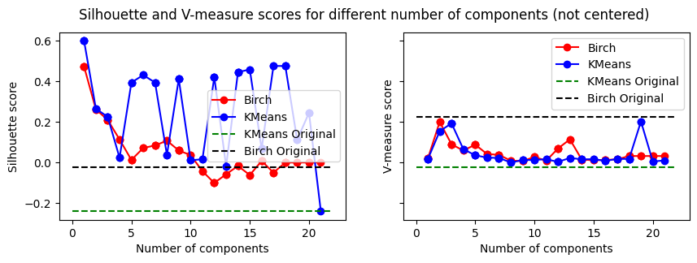
    

    <matplotlib.legend.Legend at 0x1f380360fc8>

    

    

## Centered Version

<table border="1" class="dataframe">
  <thead>
    <tr style="text-align: right;">
      <th></th>
      <th>SV1</th>
      <th>SV2</th>
      <th>SV3</th>
      <th>SV4</th>
      <th>SV5</th>
    </tr>
  </thead>
  <tbody>
    <tr>
      <th>0</th>
      <td>-2.977704</td>
      <td>1.614314</td>
      <td>-0.712664</td>
      <td>0.343752</td>
      <td>2.192470</td>
    </tr>
    <tr>
      <th>1</th>
      <td>-2.383444</td>
      <td>-0.864070</td>
      <td>0.040100</td>
      <td>-0.608507</td>
      <td>1.955827</td>
    </tr>
    <tr>
      <th>2</th>
      <td>-2.326853</td>
      <td>-0.824022</td>
      <td>0.066377</td>
      <td>-0.683302</td>
      <td>1.706566</td>
    </tr>
  </tbody>
</table>

    
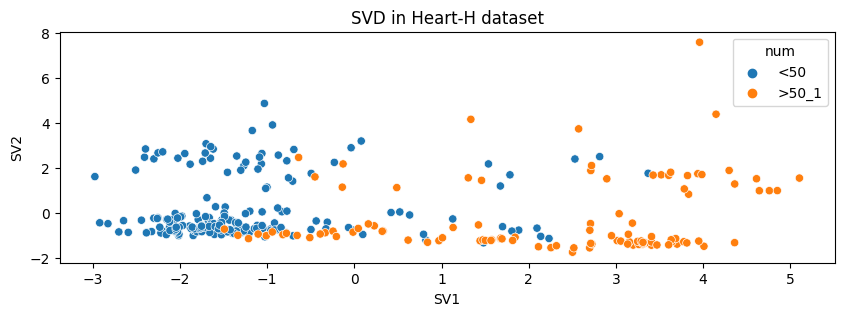
    

    
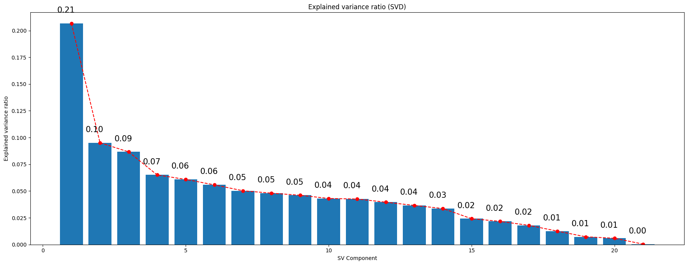
    

    

    

    <matplotlib.legend.Legend at 0x1f38d011948>

    
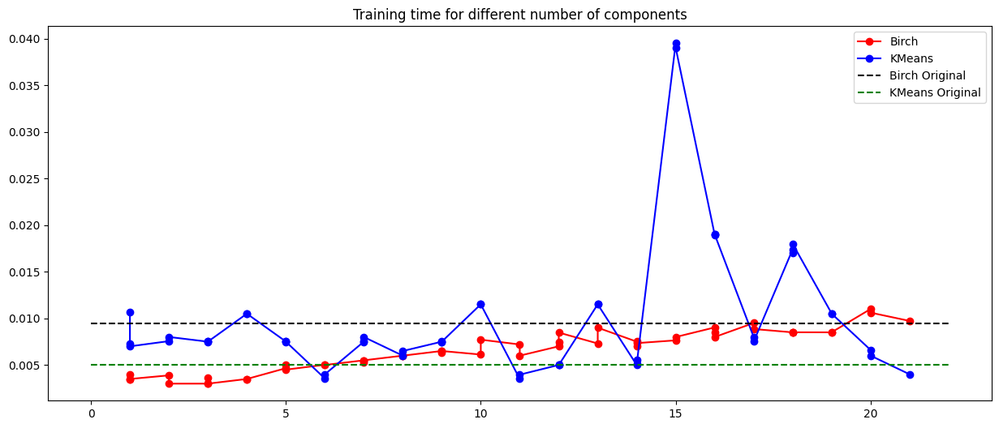
    

    Evaluation results on BIRCH using the transformed dataset
    

    (0.6546759972932525, 0.35097075746552553)

    Evaluation results on KMeans using the transformed dataset
    

    (0.7447078551579809, 0.3807503584656771)

    
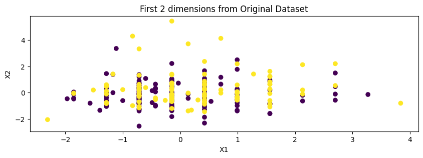
    

# 6. Visualize in low-dimensional space

    
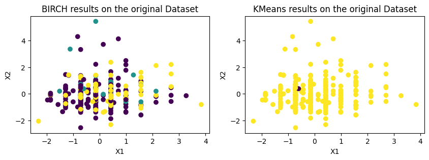
    

    

    

