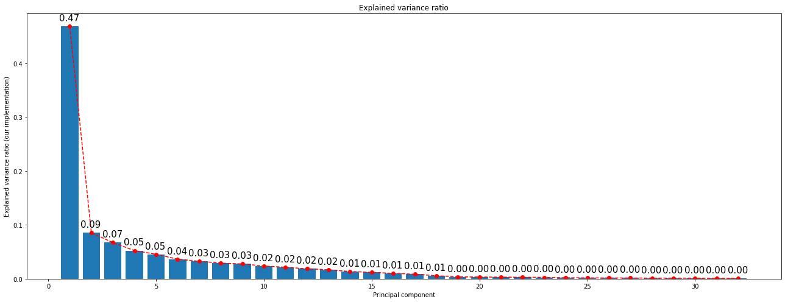
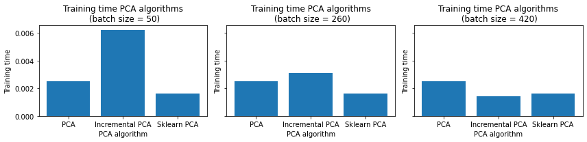
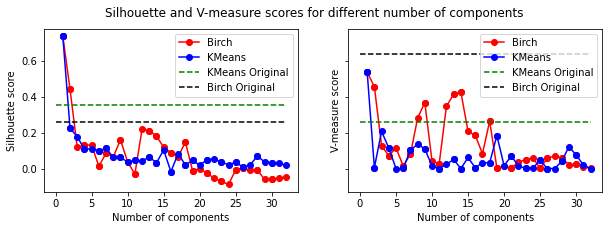

# Visualization on Vote Dataset

Vote dataset is composed by 435 samples and 17 features. All the features are categorical and binary. The dataset is loaded and the first 3 samples are shown in the following table.

As all of its variable are categorical, this analysis is done using One Hot Encoding. This is done to avoid the problem of ordinality. If the variables were ordinal, the PCA would be affected by the order of the variables. This is not the case so One Hot Encoding is used.

It's an object of interest for us to understand how dimensionality reduction techniques perform in this type of datasets.

| Class | handicapped-infants_n | handicapped-infants_y | water-project-cost-sharing_n | water-project-cost-sharing_y |
|-------|-----------------------|-----------------------|-----------------------------|-----------------------------|
|   1   |           1           |           0           |             0               |             1               |
|   1   |           1           |           0           |             0               |             1               |
|   0   |           0           |           0           |             0               |             1               |

# 2. Analyze PCA implementation

In this case, the analysis is done in the Vote dataset. The dataset is loaded and the PCA algorithm is applied to the dataset. The results are shown in the following subsections.

All the features are categorical so no previous standardization is needed. Inside the algorithm, data centralization is done.

To check and analyze the results, all components are preserved even if only the first two are shown in the figures.

## 2.1. Handmade PCA

After applying the algorithm to the dataset, the five first principal components are shown in the following table. Given that this transformations are linear and based on the covariance matrix, no real world understanding can be extracted, at first glance, from the new coordinates.

|   | PC1       | PC2       | PC3       | PC4       | PC5       |
|---|-----------|-----------|-----------|-----------|-----------|
| 0 | -2.538132 | 0.208806  | -0.664641 | -0.174588 | 0.450081  |
| 1 | -2.566310 | 0.385575  | 0.730238  | 0.070440  | 0.545899  |
| 2 | -1.181888 | 1.863804  | -0.193548 | -0.056694 | -0.517372 |

Given that the data is implicitly centered but not standardized, the mean of the data is zero but its variance is not one. It doesn't affect the results but it is important to take into account when analyzing the results. As can be observed in the following table, the mean of the data is zero but the variance is not one.

|      | PC1          | PC2          | PC3          | PC4          | PC5          |
|------|--------------|--------------|--------------|--------------|--------------|
| mean | 1.429253e-16 | -1.250596e-16| 6.061562e-17 | 2.261760e-16 | -2.779386e-16|
| std  | 1.899175e+00 | 8.106390e-01 | 7.187142e-01 | 6.343247e-01 | 5.914352e-01 |
| min  | -2.674723e+00| -1.830662e+00| -1.672052e+00| -1.657765e+00| -2.113420e+00|
| max  | 2.520503e+00 | 2.093992e+00 | 1.432702e+00 | 1.671510e+00 | 1.636564e+00 |

The classes are quite well separated in the first two components. The first component is the one that separates the classes the most. The second component separates the classes but not as much as the first one.

It's noticeable that the half of the Principal Components don't explain anything. This can be explained by the fact that the data is categorical and binary and in our One Hot Encoding, there is a column for Yes and another one for No. This causes that each pair of features are linearly dependent and hence, they don't provide any information, which is represented as a zero variance in the PC space.

    
If our own PCA implementation is ran, the results are exactly the same. This is because the algorithm is the same and the results are the same. The only difference is that the algorithm is implemented in a different way.

## 2.2. Sklearn PCA

When Scikit-Learn's implementation is applied to our dataset, the results are the same respect to the coordinates in our new PC space.

|   | PC1       | PC2       | PC3       | PC4       | PC5       |
|---|-----------|-----------|-----------|-----------|-----------|
| 0 | 2.538132  | 0.208806  | 0.664641  | -0.174588 | -0.450081 |
| 1 | 2.566310  | 0.385575  | -0.730238 | 0.070440  | -0.545899 |
| 2 | 1.181888  | 1.863804  | 0.193548  | -0.056694 | 0.517372  |

The only difference found, is that the signs are changed. This is because the only restrictions are in the orthogonality and unitarity of the components. But there is freedom in the choice of the sign of the components.

# 3. Compare with IncrementalPCA

The PCA object proves to be beneficial but exhibits limitations when dealing with large datasets. Its primary drawback is its exclusive support for batch processing, necessitating that all data fit into main memory. In contrast, the IncrementalPCA object offers an alternative processing approach, enabling partial computations that closely align with PCA results while handling data in a minibatch manner.

|   | PC1       | PC2       | PC3       | PC4       | PC5       |
|---|-----------|-----------|-----------|-----------|-----------|
| 0 | 2.538132  | 0.208806  | 0.664641  | 0.174588  | -0.450081 |
| 1 | 2.566310  | 0.385575  | -0.730238 | -0.070440 | -0.545899 |
| 2 | 1.181888  | 1.863804  | 0.193548  | 0.056694  | 0.517372  |

The main difference is performance in time and memory. The Incremental PCA is much faster for big datasets than the PCA and it uses less memory. However, the results are not exactly the same. The explained variance ratio is the same but the components are not. This is because the IncrementalPCA is an approximation of the PCA. The approximation is good but it is not exact.

What can be observed from the following comparison is that, when batch size is increased, IPCA is faster and uses less memory. However, in this case, approximation error from IPCA is negligible. This is observed from the difference in two first explained variance ratio and the average difference in components. The approximation error is not noticeable.

In the other hand, it doesn't either speed up the process. This is because the dataset is not big enough to notice the difference.
    

    

For a `batch_size` equal to the number of samples, the results are the same as the PCA. This is because the algorithm is the same. The visible difference in the plots can be due to external factors such as the random initialization of the algorithm.

Our implementation of PCA is faster than the incremental one until `batch_size` of 260. However, when `batch_size` is increased, the IPCA is faster as it is expected given that sklearn PCA is faster than ours.

    

    

# 4. Use PCA with k-Means and BIRCH to compare performances

As it was mentioned before, after projecting the data into the 2 first Principal Components, the classes are quite well separated. A lot of variables weren't providing almost any information in terms of variance. This causes the well known dimensionality curse, in which when the number of features is increased, the performance of the algorithm decreases. This is why PCA is used, to reduce the number of features and hence, the dimensionality of the data.

As can be infered from the previous plot, in every case, incrementing the number of components even adding more information, leads to equal or worse results. This is because of the dimensionality curse. The more features, the worse the performance of the algorithm.

In the case of silhouette score, a model trained only with the first component has far better value than in the case of the model trained without applying PCA.

In the other hand, in terms of V-Measure, KMeans increases its performance when trained with just one component. However, Birch's performance slightly decreases. As it is an informed external metric, it is more sensitive to the information loss.

Another interesting fact is that both algorithms have exactly the same performance when trained with the first component.

|                                     | BIRCH | KMeans | Birch (PC1) | KMeans (PC1) |
|-------------------------------------|---------------------------|---------------------------|-------------------|--------------------|
| Silhouette                          | 0.26                      | 0.35                      | 0.74              | 0.74               |
| V-Measure                           | 0.64                      | 0.54                      | 0.54              | 0.54               |

    

Performance in time improves as well. This difference would be more noticeable if the dataset was bigger. From here, another advantage of dimensionality reduction method can be inferred. It is not only that the performance of the algorithm increases but also the time needed to train the algorithm decreases.

# 5. Cluster the transformed Data (SVD) using K-Means and Birch

Use sklearn.decomposition.truncatedSVD to reduce the dimensionality of your data sets
and cluster it with your own k-Means, the one that you implemented in Work 1, and with the
BIRCH from sklearn library. Compare your new results with the ones obtained previously. 

## Non Centered Data

If SVD is directly applied to the data, the behavior is strange. The first singular value is the lowest one and the rest are sorted from higher to lower magnitude.

|   | SV1       | SV2       | SV3       | SV4       | SV5       |
|---|-----------|-----------|-----------|-----------|-----------|
| 0 | 2.706905  | -2.462044 | 0.216076  | 0.663765  | -0.177440 |
| 1 | 2.929801  | -2.476804 | 0.409878  | -0.735057 | 0.086129  |
| 2 | 2.464877  | -1.118496 | 1.868968  | 0.186572  | -0.044793 |

    

And the distribution of the singular values is similar to the one we had for PCA but in this case, the first singular value is the lowest one, being the first one 0.01, the second one 0.47, the third one 0.08 and the rest are decreasing in magnitude.
    

## Centered Version

If data gets scaled and centered, the behavior is the expected one. The first singular value is the highest one and the rest are sorted from higher to lower magnitude.

Indeed, the same behavior than PCA is observed.

|   | SV1       | SV2       | SV3       | SV4       | SV5       |
|---|-----------|-----------|-----------|-----------|-----------|
| 0 | 5.089195  | 0.481182  | 1.282707  | -0.481998 | -0.939985 |
| 1 | 5.150858  | 0.597434  | -1.472942 | 0.084576  | -1.127143 |
| 2 | 2.506092  | 3.859816  | 0.030941  | -0.091015 | 1.005174  |

# 6. Visualize in low-dimensional space

In this subsection, original data sets are visualized together with the result of the k-Means and BIRCH algorithms without the dimensionality reduction, and the result of the k-Means and BIRCH algorithms with the dimensionality reduction. To visualize in a lowdimensional space (2D or 3D) PCA and ISOMAP approaches are used. 

Given that the data is categorical, the visualization of its 2 first components is not very useful. Until now, 2 first linear projections have been used in order to visualize the data, such as SVD and PCA. The result is that they both provide similar information.

In this case, Self Organized Maps are used in order to have a nonlinear point of view, i.e. to use a different approach.

    

  
   <!-- Adjust as needed -->

In this case, both algorithms provide similar information. This can be due to the fact that the data is not very complex and hence, the linear projection is enough to visualize the data.
